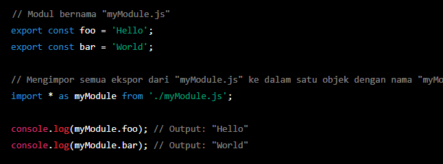
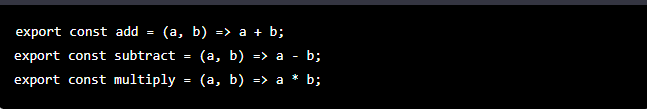
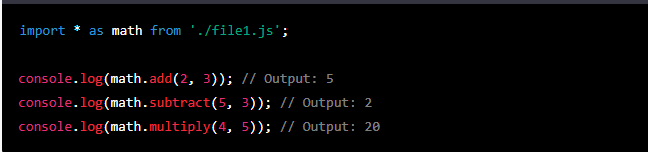
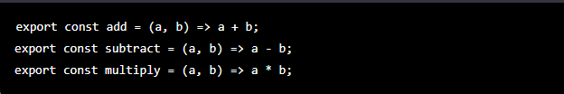
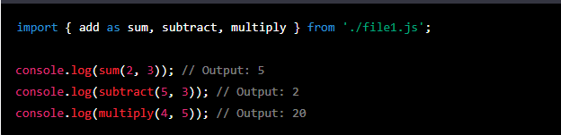

# IMPORT ALL
## 1. Pengertian Import All pada javascript module
Import all atau disebut juga namespace import pada JavaScript modul adalah salah satu cara untuk mengimpor semua ekspor dari suatu modul ke dalam satu objek tunggal. Dengan menggunakan fitur ini, kita dapat mengakses semua ekspor dari modul yang diimpor melalui objek tunggal tersebut.  
contoh penggunaan import All :
 

Dalam contoh di atas, objek myModule akan berisi semua ekspor yang dihasilkan oleh modul myModule.js, yaitu foo dan bar. Dengan menggunakan objek myModule, kita dapat mengakses ekspor tersebut secara terpisah.

Penggunaan import all pada JavaScript modul sangat berguna ketika kita ingin mengimpor banyak fungsi atau variabel dari modul yang sama dan ingin menghindari penulisan nama fungsi atau variabel yang sama berulang kali. Namun, perlu diingat bahwa penggunaan import all dapat mempengaruhi kinerja aplikasi jika terlalu banyak fungsi dan variabel diimpor pada satu waktu.

## 2. Cara menggunakan import all dalam modul javascript
Di JavaScript, Anda dapat menggunakan pernyataan impor untuk mengimpor semua ekspor dari modul lain ke modul Anda saat ini. Ini sering disebut sebagai "impor semua" atau "impor namespace". Inilah cara melakukannya:

1. Mulailah dengan membuat file JavaScript baru, sebut saja main.js.

2. Di main.js, gunakan pernyataan impor untuk mengimpor semua ekspor dari modul lain. Misalnya, jika Anda ingin mengimpor semua ekspor dari modul bernama utils.js, Anda akan menulis:

Ini mengimpor semua ekspor dari utils.jsdan menempatkannya dalam satu objek bernama utils.

3. Anda sekarang dapat mengakses ekspor dari utils.jsmenggunakan notasi titik pada utilsobjek. Misalnya, jika utils.jsmengekspor fungsi bernama sum, Anda dapat memanggilnya seperti ini:

Perhatikan bahwa import * assintaksnya adalah fitur ES6/ES2015 dan mungkin tidak didukung oleh semua lingkungan JavaScript. Selain itu, penting untuk mempertimbangkan dampak potensial pada ukuran dan performa kode Anda saat menggunakan pernyataan "impor semua", karena mungkin mengimpor lebih dari yang sebenarnya diperlukan. 

## 3. Contoh lain mengenai penggunaan import all
Di JavaScript, saat Anda ingin mengimpor semua fungsi dan variabel dari modul lain,  
Anda dapat menggunakan sintaks import * as. Berikut contohnya:

// file1.js

// file2.js

Dalam contoh di atas, kita memiliki tiga fungsi add, subtract, dan multiplydidefinisikan di file1.js. Kami mengimpor ketiga fungsi dalam file2.jsmenggunakan import * assintaks dan menyimpannya di mathobjek. Kami kemudian dapat memanggil fungsi-fungsi ini menggunakan mathobjek sebagai namespace.

## 4. Perbedaan antara Import All dengan Import alias
Dalam module JavaScript, terdapat dua cara untuk mengimpor fungsi atau variabel dari modul lain, yaitu dengan menggunakan import * as(import all) atau import { } as(import alias).

Perbedaan antara keduanya adalah:

1. Import All ( import * as) : Saat menggunakan import * as, semua fungsi dan variabel yang diekspor dari modul asal akan diimpor ke dalam objek tunggal. Anda kemudian dapat menggunakan objek ini untuk mengakses fungsi dan variabel tersebut dengan menyertakan nama modul asal sebagai awalan. Contohnya seperti contoh yang saya berikan di jawaban sebelumnya.

2. Import Alias ​​( import { } as) : Saat menggunakan import { } as, Anda dapat memberikan nama alias untuk fungsi atau variabel yang diimpor dari modul asal. Ini memungkinkan Anda untuk mengganti nama fungsi atau variabel dengan nama yang lebih mudah diingat atau lebih cocok untuk proyek Anda. Contohnya seperti berikut: 
// file1.js

// file2.js

Dalam contoh ini, kami mengimpor adddari file1.jsdan memberikan nama alias sum. Kami kemudian dapat menggunakan nama alias ini untuk memanggil fungsi add. Kami juga mengimpor subtractdan multiplytanpa memberikan alias, jadi kami dapat menggunakan nama fungsi yang sama seperti di file1.js.

## 5. Kapan kita menggunakan import all dan kapan menggunakan import alias
Pemilihan antara import all dan import alias tergantung pada kebutuhan dan preferensi Anda.

Import all (namespace import) sangat berguna ketika ingin mengimpor banyak fungsi atau variabel dari modul yang sama dan ingin menghindari penulisan nama fungsi atau variabel yang sama berulang kali. Import all memudahkan kita dalam mengakses semua ekspor dari modul yang diimpor melalui objek tunggal yang diberi nama sesuai keinginan. Dengan begitu, kita dapat dengan mudah mengakses fungsi dan variabel yang diperlukan tanpa perlu menuliskan nama mereka berulang kali. Namun, penggunaan import all juga dapat memengaruhi kinerja aplikasi jika terlalu banyak fungsi dan variabel yang diimpor pada satu waktu.

Sementara itu, import alias (named import) sangat berguna ketika ingin memberi nama baru pada suatu ekspor agar lebih mudah dipahami atau untuk menghindari konflik nama dengan ekspor lain yang sudah ada. Import alias memungkinkan kita untuk mengimpor fungsi dan variabel yang dibutuhkan dari modul, dan memberi nama baru sesuai keinginan. Dengan begitu, kita dapat lebih mudah memahami apa yang diimpor dan tidak perlu khawatir tentang kemungkinan terjadinya konflik nama.

Dalam banyak kasus, pemilihan antara import all dan import alias tergantung pada kebutuhan proyek dan gaya pemrograman yang diadopsi. Oleh karena itu, penting untuk mempertimbangkan kebutuhan dan preferensi Anda saat memilih di antara keduanya.

