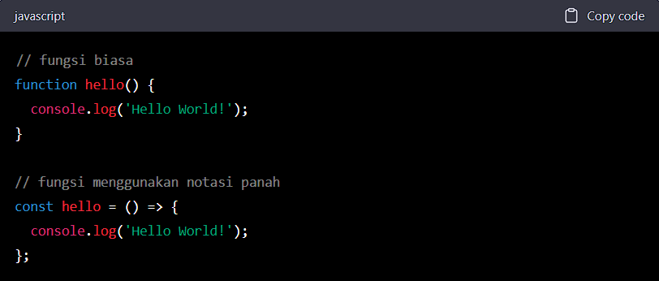
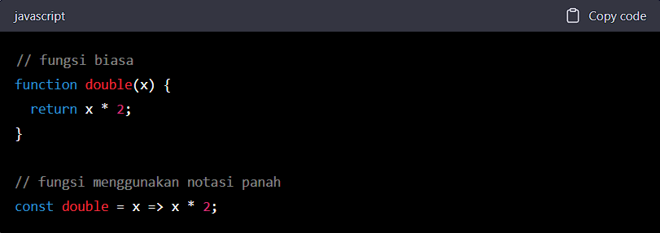
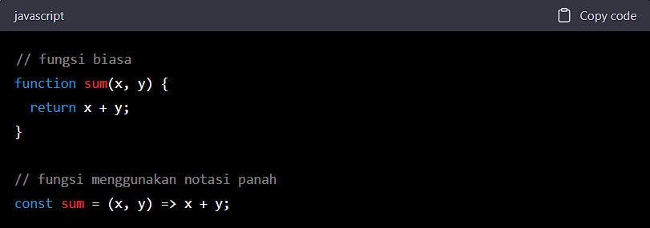
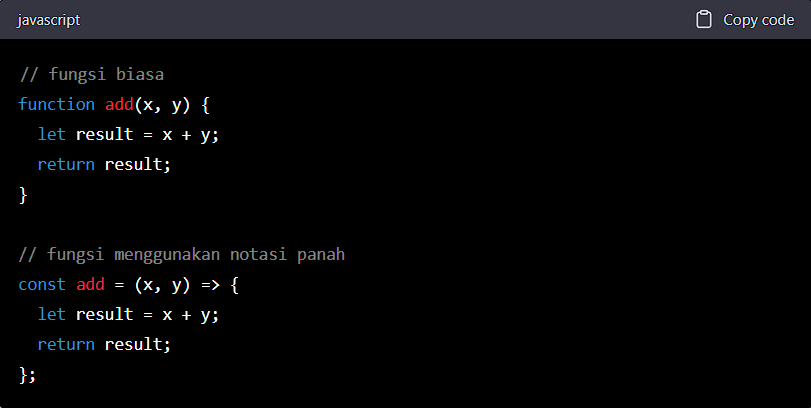

Arrow notation atau notasi panah dalam JavaScript biasanya digunakan untuk menulis fungsi dengan sintaks pendek dan mudah dibaca. Notasi ini diperkenalkan dalam standar ECMAScript 6 (ES6) sebagai salah satu fitur baru dalam bahasa pemrograman JavaScript.

Berikut adalah contoh sintaks notasi panah dalam JavaScript:

Contoh 1: Fungsi tanpa parameter
javascript  

Ketika sebuah fungsi tidak membutuhkan parameter, notasi panah dapat digunakan untuk membuat sintaks yang lebih singkat dan mudah dibaca.

Contoh 2: Fungsi dengan satu parameter
javascript

Jika sebuah fungsi hanya membutuhkan satu parameter, tanda kurung pada parameter dapat dihilangkan dan digantikan dengan notasi panah.

Contoh 3: Fungsi dengan beberapa parameter
javascript
Copy code

Jika sebuah fungsi membutuhkan beberapa parameter, notasi panah tetap digunakan, namun tanda kurung tetap diperlukan.

Contoh 4: Fungsi dengan blok kode
javascript

Jika sebuah fungsi memiliki lebih dari satu statement atau blok kode, notasi panah harus digunakan dengan tanda kurung kurawal untuk membungkus kode tersebut.

Notasi panah dapat membuat sintaks fungsi JavaScript menjadi lebih singkat dan mudah dibaca, terutama ketika digunakan untuk membuat fungsi sederhana dengan satu atau beberapa statement. Namun, pada kasus fungsi yang lebih kompleks, notasi panah mungkin tidak cocok digunakan. Hal ini tergantung pada kebutuhan dan preferensi programmer dalam menulis kode JavaScript.