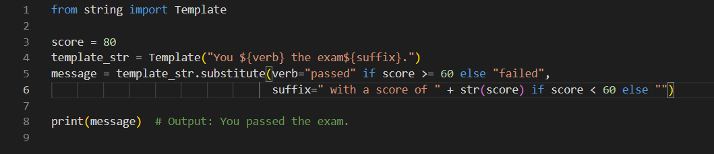

# String Template 

## Pengertian

Templat string adalah fitur dalam bahasa pemrograman yang memungkinkan Anda menentukan string dengan placeholder yang dapat diganti dengan nilai saat runtime. Template string menyediakan cara mudah untuk membuat string yang menggabungkan teks tetap dengan data dinamis, seperti input pengguna atau hasil perhitungan. Di sebagian besar bahasa pemrograman, templat string ditentukan menggunakan sintaks khusus yang menunjukkan lokasi placeholder. Misalnya, dengan Python, Anda dapat menentukan templat string menggunakan sintaks f-string, yang terlihat seperti ini:

 

## Contoh kode program template string 
Berikut adalah contoh penggunaan templat string dengan Python:  

Dalam contoh ini, kami mendefinisikan tiga variabel name, age, dan occupationyang menyimpan beberapa data dinamis. Kami kemudian menggunakan tiga cara berbeda untuk membuat string pesan yang menyertakan data ini:

Menggunakan f-string (literal string yang diformat) dengan kurung kurawal untuk menginterpolasi variabel langsung ke dalam string.
Menggunakan str.format()metode untuk memasukkan variabel ke dalam string menggunakan placeholder bernomor.
Menggunakan %-formatting, cara lama untuk memformat string yang menggunakan %placeholder.
Ketiga pendekatan tersebut menghasilkan string pesan yang sama. Saat kami menjalankan kode, kami mendapatkan output berikut :

## Contoh penggunaan string template yang benar
1. Substitusi variabel sederhana:

Dalam contoh ini, kami membuat string template yang memiliki tiga placeholder ($name, $age, dan $occupation), lalu menggunakan metode substitute()untuk mengganti placeholder ini dengan nilai yang sesuai. Kami meneruskan nilai sebagai argumen kata kunci ke substitute()metode.
2. Melarikan diri dari karakter placeholder :

Dalam contoh ini, kami menggunakan kurung kurawal untuk mengapit productvariabel di placeholder untuk menghindari kebingungan dengan variabel $2in price. Kami keluar dari kurung kurawal dengan menggandakannya (${product}s) untuk menunjukkan bahwa mereka adalah bagian dari string templat, bukan placeholder.
3. Pernyataan bersyarat :

Dalam contoh ini, kami menggunakan ekspresi bersyarat ( x if condition else y) untuk menentukan apakah siswa "lulus" atau "gagal" ujian berdasarkan nilai mereka. Kami juga menggunakan ekspresi bersyarat untuk menambahkan scoreakhiran ke pesan hanya jika siswa gagal dalam ujian. Kami menggabungkan string kosong ke akhiran jika siswa lulus, secara efektif melewatkannya.